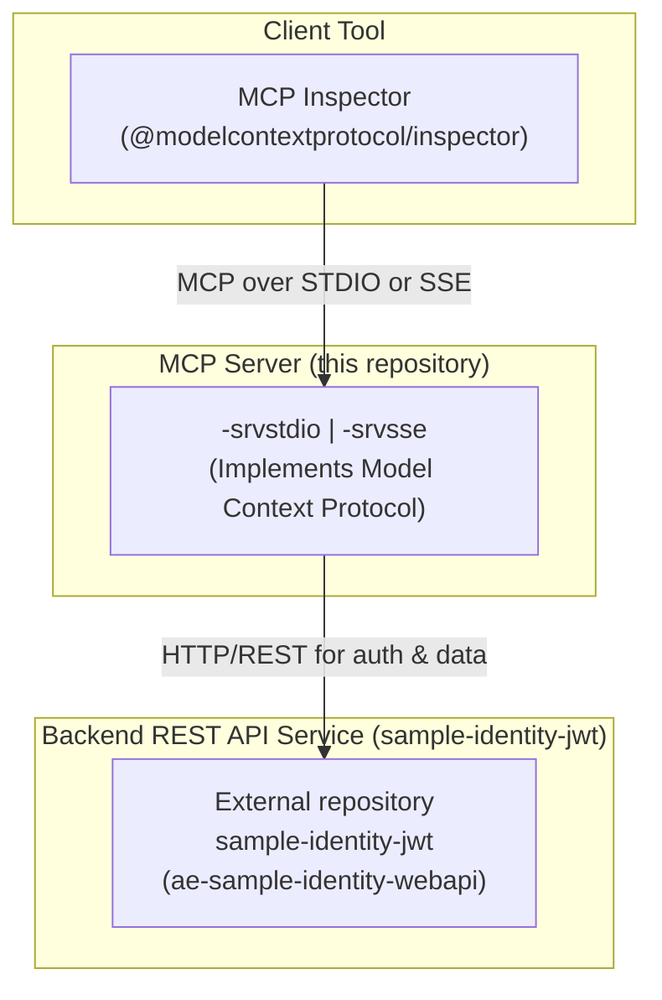

# sample-mcp

This repository contains sample projects demonstrating the Model Context Protocol (MCP). This application communicates with a backend REST Web API to function. 

## Architecture Overview

The solution consists of three main components: the MCP Inspector (client), the MCP Server (this project), and a backend REST API for identity management. The MCP Server acts as a middle layer, handling requests from the client and communicating with the backend API for tasks like authentication.



## Communicating with the backend REST API
Before running the application, you need to ensure the required API service is running. Please start the `ae-sample-identity-webapi` service from the `sample-identity-jwt` repository. Refer to the instructions within the `sample-identity-jwt` repository to build and run the service.

## Transport STDIO
- ae-sample-mcp-srvstdio (Startup project)
- ae-sample-mcp-lib
- ae-sample-mcp-unittests

This project is a sample MCP server that communicates over standard input/output (stdio).

### MCP Inspector

It is designed to work with the Model Context Protocol (MCP) Inspector, which lets you inspect and debug the communication between your application and the MCP server.

To start the inspector, navigate to the application folder (/ae-sample-mcp-srvstdio) and run the following command using Node.js:
```bash
npx @modelcontextprotocol/inspector dotnet run
```
Open inspector with token pre-filled.

MCP Inspector settings:
- Transport Type: STDIO

## Transport StreamableHttp. Server-Sent Events (SSE)
- ae-sample-mcp-srvsse (Startup project)
- ae-sample-mcp-lib
- ae-sample-mcp-unittests

This project is a sample MCP server that communicates over HTTP using Server-Sent Events (SSE). It exposes tools for managing identity claims and requires token-based authentication.

### MCP Inspector

Start mcp server. Navigate to the application folder (/ae-sample-mcp-srvsse) and run the following command:
```bash
dotnet run
```

To start the inspector, run the following command using Node.js:
```bash
npx @modelcontextprotocol/inspector
```
Open inspector with token pre-filled.

MCP Inspector settings:
- Transport Type: SSE
- URL: http://localhost:3001/mcp/sse
- Authorization -> Bearer Token: YOUR_SUPER_SECRET_AND_UNIQUE_TOKEN_REPLACE_ME
